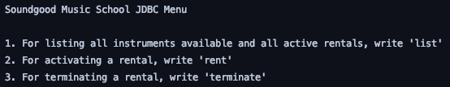
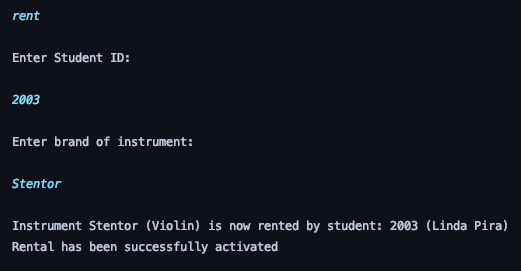
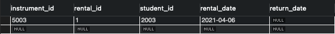

# Soundgood Music School

### Description

soundgoodMusicSchool is an application for database management of instrument rentals. Variuos functions like activating a rental, is made in the terminal, and updates the data in the database by executing queries. The program fetches data from the database and checks requested information like stock quantity of a specific instrument or ongoing rentals.

### Built With

- Java
- SQL

### Usage

When compiled, user is encountered by a list of options:

When, for example, proceeding with activating a rental, the following output will look like this:

When the rental has been activated and registered, the database will be updated with the new data:

### Contact

Name: Shadab Ahmed

E-mail: shadaba@kth.se

lst